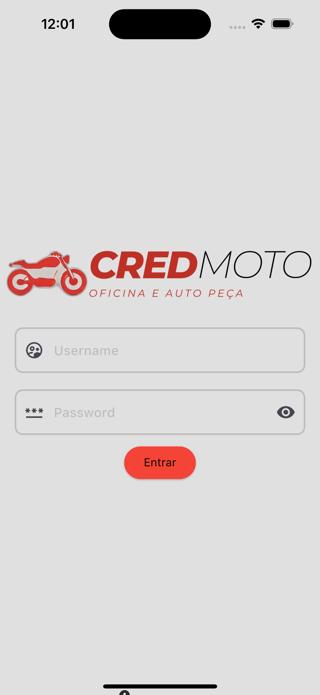
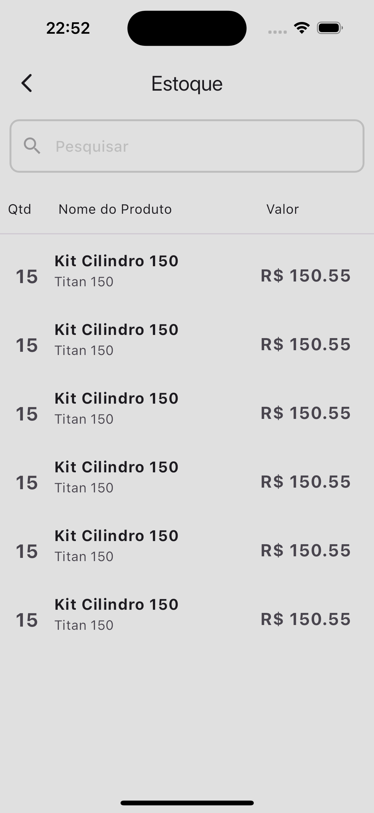

> :construction: Projeto Em Construção :construction:

# Flavor Fusion

Este é um aplicativo de receitas, na qual cada usuário consegue armazenar suas próprias receitas, além de ter receitas próprias para todos os usuários.

## Layouts
> :construction: Projeto Em Construção :construction:
 
 
<!--   -->

#### O que já foi feito?
- [ ] Auth Screen;
- [ ] Home Screen;
- [ ] Accounts Screen.
- [X] Stock Screen.
- [ ] Expensives Screen.
- [ ] Product Screen.
- [ ] Search Screen.

### Dependências
- ``get: ^4.6.6``

### Tecnologias utilizadas
- ``VSCode``
- ``Dart``
- ``Flutter``
- ``XCode = Emulador de IOs``
- ``Android Studio = Emulador Android``
- ``iPad = iPadOS``